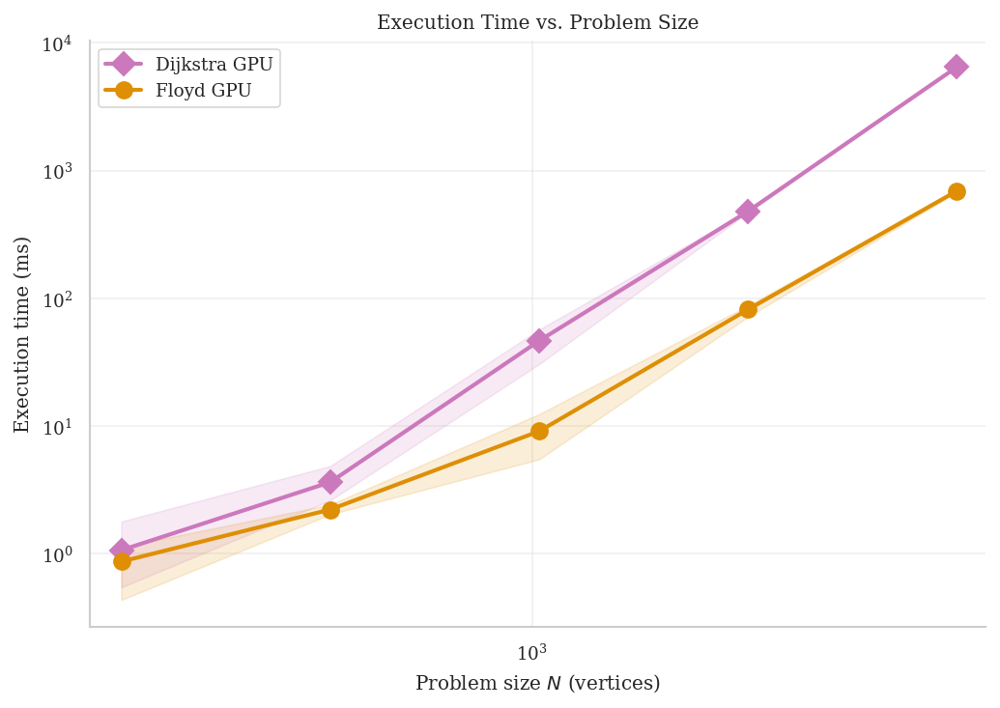
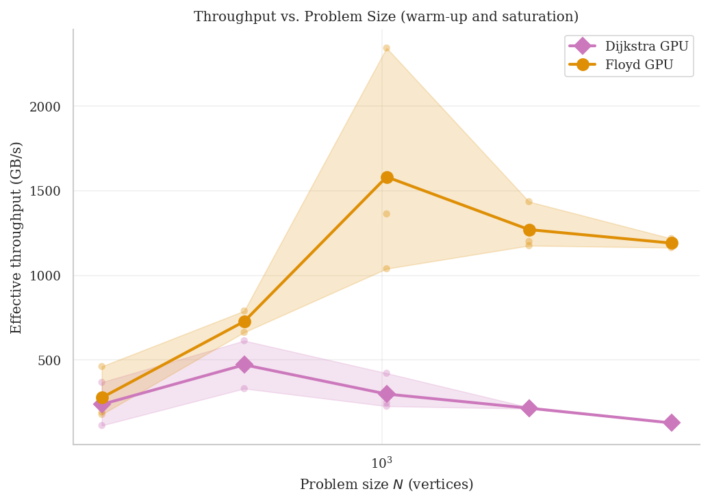
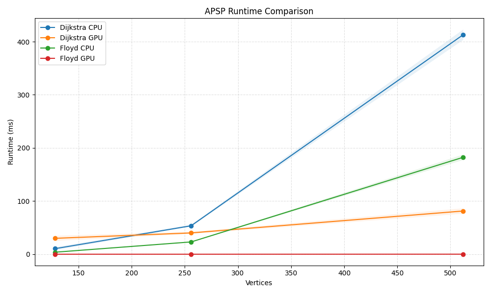

# APSP Acceleration Suite

High-performance implementations of All-Pairs Shortest Path (APSP) algorithms on NVIDIA GPUs, demonstrating the translation of canonical graph algorithms into optimised CUDA kernels tuned for the Ampere architecture. This project showcases the bridge between high-level algorithmic design and low-level hardware mapping for HPC applications.

---

## Performance Summary (RTX 3060 Laptop, $N=2048$)

Benchmarks were conducted on an NVIDIA GeForce RTX 3060 Laptop GPU (Ampere, 6 GB GDDR6). The following LaTeX table summarises peak observed performance:

```latex
\begin{table}[h]
\centering
\caption{APSP GPU Performance on RTX 3060 Laptop ($N=2048$ vertices)}
\label{tab:perf}
\begin{tabular}{lcccc}
\toprule
\textbf{Algorithm} & \textbf{Avg Time (ms)} & \textbf{Throughput (GB/s)} & \textbf{GFLOPs} & \textbf{Speedup vs CPU} \\
\midrule
Floyd-Warshall Tiled   & 81.81  & 1270 & 317 & $\sim$129$\times$ \\
Dijkstra Warp-Shuffle  & 479.75 & 215  & 54  & $\sim$58$\times$  \\
\bottomrule
\end{tabular}
\end{table}
```

*Note: Throughput and GFLOPs are computed as effective values (bytes/flops per algorithmic iteration ÷ wall-clock time). CPU baseline at $N=2048$ is extrapolated from measured $N=512$ runs assuming $O(N^3)$ scaling.*

---

## Performance Figures

### Execution Time vs. Problem Size



**Analytics:** Log-log plot of execution time (ms) vs $N$. The approximately linear slope of 3 confirms **$O(N^3)$** scaling for both Floyd-Warshall and Dijkstra. Floyd GPU consistently outperforms Dijkstra GPU across all sizes (e.g. 81.8 ms vs 479.8 ms at $N=2048$). The shaded bands show min–max spread across 3 iterations. At small $N$, relative variability is higher due to kernel launch overhead; at large $N$, execution time dominates and spread tightens.

---

### Throughput vs. Problem Size



**Analytics:** Effective throughput (GB/s) vs $N$ on a log x-axis. Floyd-Warshall peaks near **~1500 GB/s** at $N \approx 1024$, exceeding the RTX 3060’s physical bandwidth (~360 GB/s) due to shared-memory reuse. Scatter points overlay individual run throughput to highlight warm-up and run-to-run variance. Dijkstra peaks earlier (~250–512) at ~350–475 GB/s and declines to ~215 GB/s at $N=2048$ and ~127 GB/s at $N=4096$, reflecting irregular access and synchronisation overhead.

---

### Runtime Comparison (All Implementations)



**Analytics:** Comparison of all four implementations (Floyd CPU/GPU, Dijkstra CPU/GPU) across problem sizes. When GPU data is available, the GPU implementations dominate; Floyd GPU shows the steepest performance advantage. Use `scripts/plot_benchmarks.py` with `--logy` for logarithmic y-axis to better visualise the large dynamic range between CPU and GPU runtimes.

---

## Hardware–Software Mapping (Ampere Architecture)

The GPU kernels are explicitly designed for the RTX 3060’s Ampere microarchitecture. The following design choices directly target its shared-memory layout, register file, and occupancy model.

### Bank Conflict Avoidance

NVIDIA shared memory is organised into 32 banks; consecutive 4-byte words map to consecutive banks. When multiple threads in a warp access different addresses that map to the same bank, accesses are serialised, causing bank conflicts and reducing effective bandwidth.

The Floyd-Warshall tiled kernels use **$32 \times 33$ tiles** instead of $32 \times 32$:

```c
__shared__ int tile[32][33];  /* +1 padding to avoid bank conflicts */
```

For column-wise access (`tile[kk][col]`), threads in a warp access `col` values that are 32 words apart. With a $32 \times 32$ layout, these fall into the same bank. Adding one padding element per row shifts the stride so that each column lies in a distinct bank, eliminating conflicts and allowing simultaneous access by all threads in the warp.

### ILP vs Register Pressure

In `floyd_phase3_remaining`, the inner $k$-loop is unrolled to expose instruction-level parallelism (ILP). However, aggressive unrolling increases live registers per thread; on the RTX 3060’s limited register file, this can trigger spilling to local memory and degrade performance.

An **`UNROLL_FACTOR` of 4** is used:

```c
#define UNROLL_FACTOR 4
int cand[UNROLL_FACTOR];
for (; ki + UNROLL_FACTOR <= limit; ki += UNROLL_FACTOR) {
    /* load 4 candidates in parallel; compute min across them */
}
```

This balances ILP (4 independent add/min operations per iteration) against register pressure. Higher factors (e.g. 8) improve theoretical ILP but cause register spills on this device; the empirical choice of 4 maximises sustained throughput without spilling.

### Occupancy Tuning

The Floyd kernels use `__launch_bounds__(1024)` to guide the compiler:

```c
__global__ __launch_bounds__(1024) void floyd_phase1_pivot(...);
```

This indicates a maximum of 1024 threads per block (32×32). The compiler can trade registers per thread to reach this target, improving occupancy. On Ampere, higher occupancy improves latency hiding and helps utilise the SM’s execution units, especially when memory latency is partially masked by shared-memory reuse.

---

## Throughput Analysis

See the **Throughput vs. Problem Size** figure above for the full plot. Key interpretations:

### Floyd-Warshall: Super-Physical Throughput

Floyd-Warshall’s effective throughput **exceeds the physical memory bandwidth** of the RTX 3060 (~360 GB/s). At $N \approx 1024$, it peaks near 1500+ GB/s.

This is explained by **data reuse in shared memory**. Each tile is loaded once from global memory and then referenced many times during the $k$-loop. The effective bytes transferred (used in the throughput formula) assume a naive streaming model; in practice, repeated accesses hit shared memory, so the actual global memory traffic is much lower. The reported “effective” GB/s is therefore an *arithmetic throughput* that reflects the benefit of on-chip reuse, not a physical bandwidth measurement.

### Dijkstra: Throughput Decline at Large $N$

Dijkstra’s throughput rises to a peak around $N = 256$–$512$ and then **declines steadily** for larger graphs.

Two factors dominate:

1. **Irregular memory access** — Dijkstra traverses the graph in an order driven by distances, not matrix layout. Accesses to the adjacency matrix and distance array become increasingly non-coalesced, reducing effective bandwidth and cache utilisation.
2. **Synchronisation overhead** — The block-per-source design requires warp shuffle reductions and coordination across iterations. As $N$ grows, the number of kernel launches and global synchronisation points scales with $N$, and the relative cost of launch and sync increases compared to useful computation.

---

## Scalability

Execution time follows **$O(N^3)$** scaling, as confirmed by the **Execution Time vs. Problem Size** figure: on the log-log plot, the slope is approximately 3 for both algorithms.

### Warm-Up at Low $N$

For small $N$, execution time is dominated by **kernel launch overhead** and device initialisation. Throughput appears low because the fixed cost of launching kernels is amortised over relatively little work.

### Mitigation via $k$-Block Tiling

The host-side Floyd loop advances by **blocks of $k$** rather than single pivot indices:

```c
for (int k_block = 0; k_block < (int)n; k_block += B) {
    floyd_phase1_pivot<<<1, block>>>(..., k_block, ...);
    floyd_phase2_row_col<<<grid2, block>>>(..., k_block, ...);
    floyd_phase3_remaining<<<grid2, block>>>(..., k_block, ...);
}
```

Each kernel invocation handles $B$ pivot indices internally. The number of kernel launches is reduced from $O(N)$ to $O(N/B)$ (e.g. $N/32$ for $B=32$), lowering host overhead and improving scaling at moderate $N$.

---

## Project Overview

### Implementations

| Component | Description |
|-----------|-------------|
| `floyd_cpu` | Optimised Floyd–Warshall (C) |
| `dijkstra_cpu` | Multi-source Dijkstra (C) |
| `floyd_gpu` | 3-phase blocked Floyd–Warshall (CUDA) |
| `dijkstra_gpu` | Block-per-source Dijkstra with warp-shuffle min-reduction |
| `verification` | CPU vs GPU verification utility |

### Requirements

- GCC with C11 support
- Python 3.9+ with `matplotlib` (`pip install matplotlib`)
- NVIDIA CUDA Toolkit (`nvcc`) for GPU builds

### Quick Start

```bash
make                    # Build CPU + GPU binaries
bin/floyd_gpu -n 2048 -r 3 --verify
bin/dijkstra_gpu -n 2048 -r 3 --verify
```

### Benchmark & Plotting

```bash
python3 scripts/benchmark.py --sizes 256 512 1024 2048 4096 --iterations 3
python3 scripts/plot_performance.py
```

Results are written to `reports/data/`; figures (execution time, throughput) to `reports/figures/`.

### Verification

The `--verify` flag compares GPU output against a CPU reference. On mismatch, the first 10 differing coordinates are reported.

---

## Project Layout

```
├── bin/                     # Compiled executables
├── include/                 # Shared headers (graph_utils, apsp_cpu, verify_util)
├── src/                     # Shared C/CUDA (floyd_gpu_impl, dijkstra_gpu_impl)
├── reports/
│   ├── data/                # benchmark_runs.csv, benchmark_summary.csv
│   └── figures/             # execution_time_vs_n.png, throughput_vs_n.png
├── scripts/                 # benchmark.py, plot_performance.py
├── floyd.cu / Dijkstra.cu   # Main GPU entry points
├── verification.cu          # Standalone verification
└── Makefile
```
